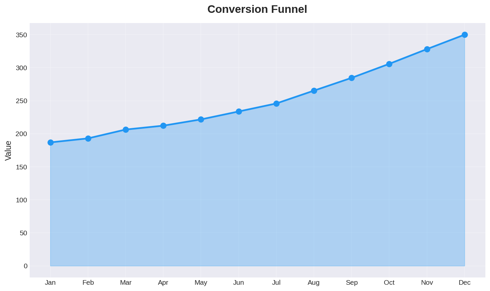
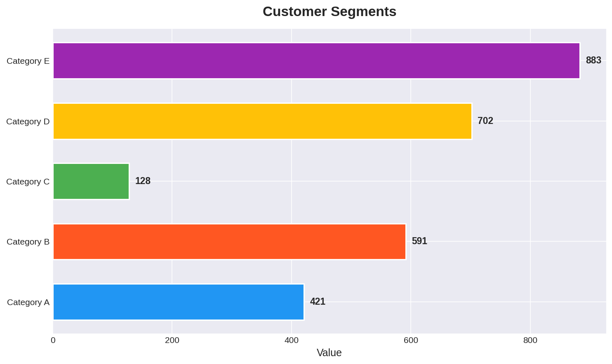
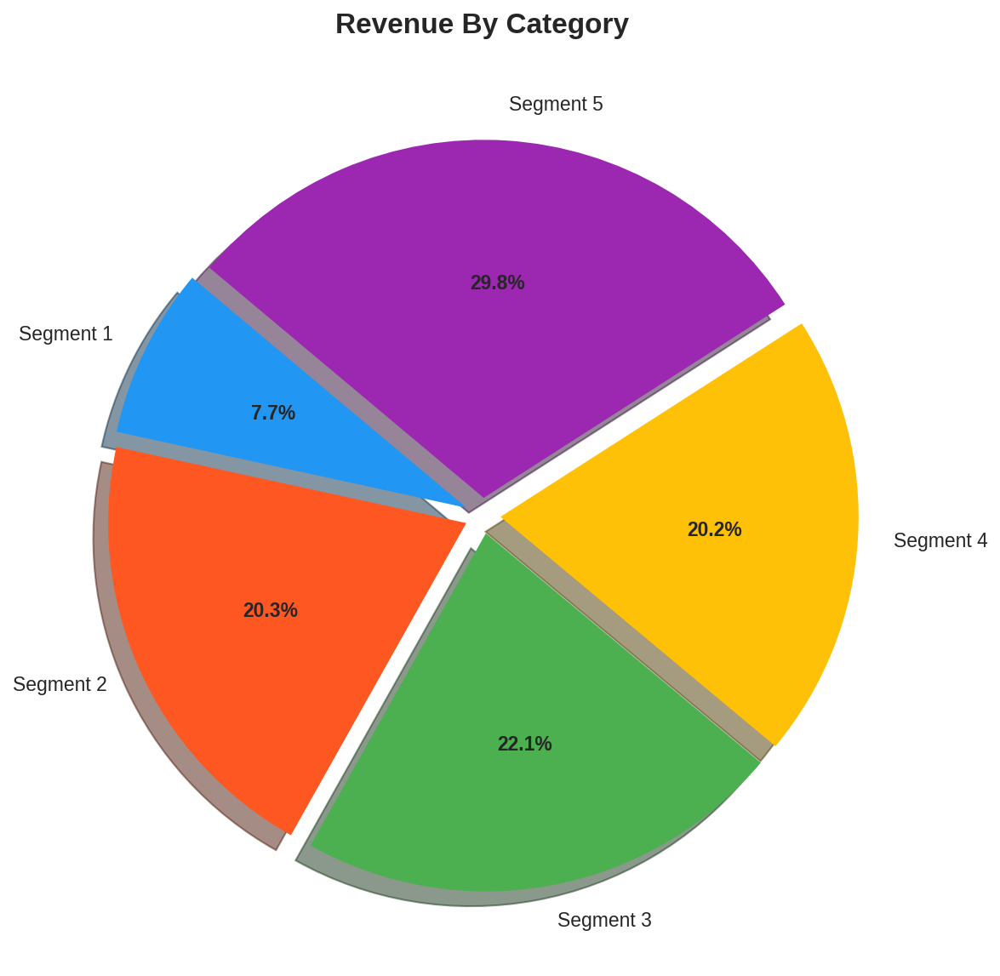
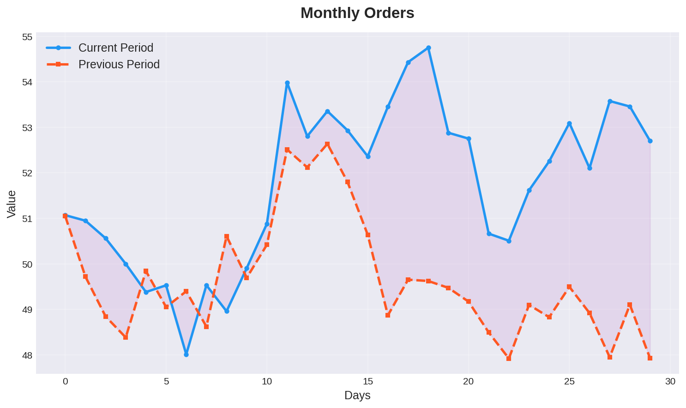

# E-Commerce Analytics Dashboard
The E-Commerce Analytics Dashboard is a web-based application designed to provide insights into e-commerce data. The dashboard features a conversion funnel, customer segments, and revenue breakdown.

## Screenshots

## Features
* Conversion funnel to track customer journey
* Customer segments to analyze customer behavior
* Revenue breakdown to visualize revenue by category
* Interactive and responsive design

## Requirements
* Python 3.8+
* Streamlit 1.20.0+
* Pandas 1.4.3+
* Plotly 5.10.0+
* Matplotlib 3.5.1+
* NumPy 1.22.3+

## Installation
1. Clone the repository: `git clone https://github.com/username/repository.git`
2. Install dependencies: `pip install -r requirements.txt`
3. Run the application: `streamlit run app.py`

## Contributing
Contributions are welcome! Please submit a pull request with your changes.